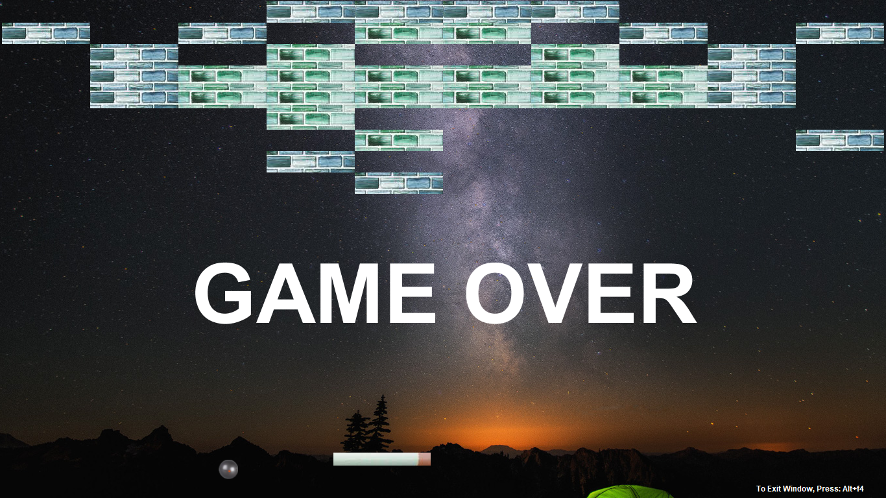

# BreakTheBricks-Game
It is a game developed in Java. Java Swing is used to develop the UI.

## How To Play

### Requirements

* JRE

### How to start the game

* Run Bricks1.class file present in src folder using below mentioned command in command prompt
``` java Bricks1 ```

* Or you can import the Bricks folder in any Java IDE and run from there.

### Controls

* Players can control bat using mouse, touchpad or keyboard arrow keys.

### Rules

* Break all the bricks by hitting the ball through bat to reach next level.
* Don't let the ball hit the ground.
* Players have 3 lives and after that, the game will be over.
* Speed of ball will be automatically increased in the higher levels.

## Screenshots




